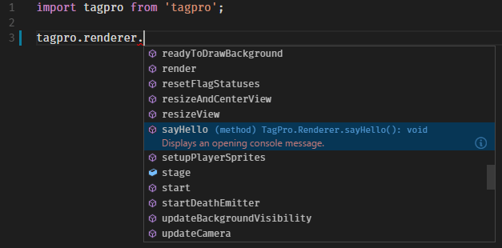

# TypeScript definitions for TagPro

The TagPro TypeScript definitions file helps with auto-completion (IntelliSense) when developing
TagPro userscripts. It works with both JavaScript and TypeScript projects, as long as
your code editor supports TypeScript definitions. I recommend
[Visual Studio Code](https://code.visualstudio.com/).

## Usage

1. Install the [typings](http://www.npmjs.com/packages/typings) npm package:

		npm install typings --global

2. Install the tagpro definitions in your userscript project:

		typings install --save --global github:keratagpro/typed-tagpro

3. Use the `tagpro` object in your code:

		tagpro.<IntelliSense happens>

## NOTES

The definition file exports the tagpro object in three different ways:

1. As a module, so you can import it using e.g. `import tagpro from 'tagpro';` or `const tagpro = require('tagpro');`.
2. As a variable on window (`window.tagpro`).
3. As a global variable (`tagpro`).
